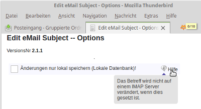
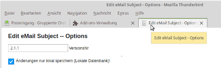
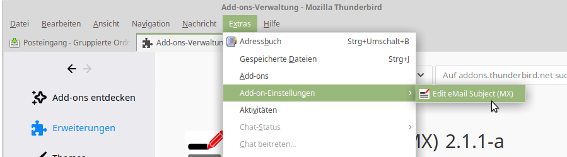
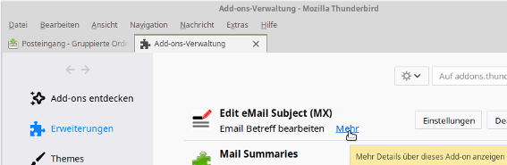

## EditMailSubject-MX
#### General Notes about this Addon
The Addon 'Edit email subject' was first published by 'JC Prin' back in 2011 with compatiblity for Thunderbird 3. It's a "Legacy, XUL extension with overlays" addon.
Currently the activ version is 2.1.1 running up to TB60.*    
For future use with TB68 and greater it's necessary to convert it's technical base and that's the purpose of this project.   
The progress of the project can be followed with this document. XPI versions are generated for the development steps so to "freeze" these steps. The XPI/ZIPs can be downloaded from the [GIT release page](https://github.com/cleidigh/EditEmailSubject-MX/releases/tag/), the first one is 2.1.1-wip.1

<hr>

### Status &nbsp; 2020-02-11 &nbsp; / &nbsp; [2.1.1-wip.3](https://github.com/cleidigh/EditEmailSubject-MX/releases/tag/2.1.1-wip3)
#### Localization  
Easy migration from a XUL based Add-on to WebExtension needs to take care about the text strings which have be stored with the chrome/locales/<addon\>.dtd files.   
See below "locales/_locales" to convert the .dtd files for use with WebExtension.   

The XUL/dtd concept allowed to reference sub-strings. That feature is covered with **options.js** &nbsp; &nbsp; &nbsp;  @since wip.3.   
_Example_   
```
"menuTitle": {
  "message": "Email &subject; bearbeiten"
},
"subject": {
  "message": "Betreff"
},
```
The resulting string for `menuTitle` will be "Email Betreff bearbeiten".

*References*
* https://developer.mozilla.org/en-US/docs/Mozilla/Add-ons/WebExtensions/Internationalization   
* https://developer.mozilla.org/en-US/docs/Mozilla/Add-ons/WebExtensions/API/i18n   
* https://www.chromium.org/developers/design-documents/extensions/how-the-extension-system-works/i18n

#### Title/Tooltiptext

To give the user additional explanations about an element on a page,
the HTML element 'title' is used, normally (?).   
However, rendering `options.html` in `webextension/options` will not display the `title`. The HTML code contains this element, but it is silently not displayed.   
For `options.html` a css special coding is offered to add an icon with the name "Help", it is mouse sensitive, a localized popup text can be displayed.
The encoding can be extended with other elements like div, p etc.

_Example_   
   

<hr>

### Status &nbsp; 2020-02-01 &nbsp; / &nbsp; [2.1.1-wip.2a](https://github.com/cleidigh/EditEmailSubject-MX/releases/tag/2.1.1-wip.2a)

With the previous version (wip-1) a user changes the **prefs/options** setting on the Add-on Manager page. Basically this is not a problem, but would be difficult / not nice with an extension with a larger number of preferences.   
Adding `open_in_tab": true` in `webextension/manifest.json` will open the `options.html` code in a new tab   

  

#### UI to access the Options Settings ####
With defining `open-in-tab` there are different ways to get access to the settings
* **Main menu**     
<br><br>
* **Addon Manager Tab with [Setting]**       
<br><br>
This opens directly the Options tab

* **Addon Manager Tab with link 'more'**      
<br><br>
Opens the Addon Overview page, there is a button [Settings] to be used to open the tab (same as point before)

--> Reference:  https://developer.mozilla.org/en-US/docs/Mozilla/Add-ons/WebExtensions/manifest.json/options_ui

_Note **//TODO**_     
_In certain cases it would be helpful to open and edit the option setting in a simple dialog._

<hr>

### Status &nbsp; 2020-01-11 &nbsp; / &nbsp; [2.1.1-wip.1](https://github.com/cleidigh/EditEmailSubject-MX/releases/tag/2.1.1-wip.1)
To be prepared for the move from TB60 to TB68 and greater, this first change includes 'webextension' for **locales,prefs,option** handling. Also the legacy prefs system is used, the `prefs` can be changed only on the Addon-Mgnr page.   
**locales** text elements are converted to 'data-l10n-id' format and stored in json format (see 'webextension' dir)

An jsm module holds WebExtension coding and also some general supporting functions.

***Note:***   
This addon version is based on https://github.com/cleidigh/EditEmailSubject-MX/scr

  For a complete change overview compare the directories   
    * EditEmailSubject-MX/scr   
    * EditEmailSubject-MX/EditMailSubject-MX/

### Naming of Addon changed!
_(only for convenience, but naming needs to be consistent all over the addon!)_

         <em:id>editemailsubject@jcp.convenant</em:id>
    was  <em:id>EditMailSubject@jcp.convenant</em:id>

### Directory structure changes:

  * chrome/content/locale --> chrome/content/locales   
     _Note:_   de-DE --> de  changed!

added:

  * `chrome/content/skin/images`     to hold image files (png/jpg/..)
  * `chrome/content/skin/platform`   for linux specific

### `webextension`
  New directory with directories
  * options
  * _locales

### `modules`
New directory with `EditMailSubject.jsm` for Options handling   

  * first step to handle prefs with `storage`
  * getting windows
  * opening window (within addon and external)
  * open/reuse TAB   
  --> in `EditMailSubject.jsm` see `//XXX MX` marks for required changes

### `install.rdf`
added/changed   
  * <<em:id>>editemailsubject@jcp.convenant
  * <<em:hasEmbeddedWebExtension>>
  * icon
  * min/maxVersion

### `chrome.manifest`
added/changed
  * `resource editemailsubject  .  `   (line has to have the dot!)
  * skin
  * locales (instead of locale), also de-DE --> de


### General Notes / Next Steps

#### Prefs of this Addon vs general situation

This Addon _'EditMailSubject'_ has only two prefs items (localOnly, version). For an Addon with more prefs items the WebExtension coding should be changed to be more flexible.

#### locales/_locales
The orignal Addon uses only .dtd files for XUL elements `like label="&lang.menuTitle;"`.    
`.properties` files are not used, no (legacy) stringhandler is loaded.

The script `migrateLocale.py` can be used to convert the `locales` to `_locales`, but eventually the dir/file positioning has to be changed manually.
